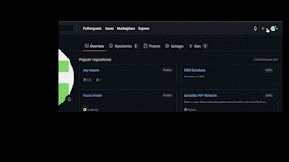
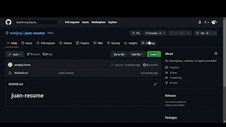
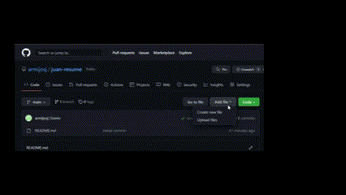
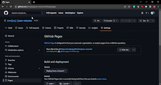

# How to host a resume on Github

## Table of contents[](#table-of-contents)
1. [Purpose](#purpose)
2. [Prerequisites](#prerequisites)
    - [Lightweight Markup Language](#lightweight-markup-language)
        - [Markdown](#markdown)
    - [Static Site Generator](#static-site-generator)
        - [Jekyll](#jekyll)
    - [Markdown Editor](#markdown-editor)
        - [Visual Studio Code](#visual-studio-code)
        - [Other options](#other-options)
    - [Distributed Version Control System](#distributed-version-control-system)
        - [Github](#github)
3. [Instructions](#instructions)
    - [Create a repository](#create-a-repository)
    - [Enabling GitHub Pages](#enabling-github-pages)
    - [Create _config.yml file (if not created automatically)](#create--configyml-file--if-not-created-automatically-)
    - [Uploading Your Resume on GitHub](#uploading-your-resume-on-github)
    - [Choosing a Jekyll Theme for Your GitHub Page](#choosing-a-jekyll-theme-for-your-github-page)
    - [Viewing your GitHub Page](#viewing-your-github-page)
    - [Viewing Your GitHub Page Through the Repository](#viewing-your-github-page-through-the-repository)
4. [Principles of Techincal Writing](#principles-of-technical-writing)
    - [Using a Lightweight Markup Language](#using-a-lightweight-markup-language)
    - [Using Static Websites](#using-static-websites)
    - [Lightweight Markup Languages and Static Site Generators](#lightweight-markup-languages-and-static-site-generators)
    - [Why Use a Distributed File Sharing System?](#why-use-a-distributed-file-sharing-system-)
5. [Resources](#resources)
6. [Authors and Acknowledgments](#authors-and-acknowledgments)
    - [Author](#author)
    - [Group Members/Peer Editors](#group-members-peer-editors)
    - [Template Author](#template-author)
7. [FAQ](#faq)
    - [Why is Markdown better than a word processor?](#why-is-markdown-better-than-a-word-processor-)
    - [Why is my resume not updating?](#why-is-my-resume-not-updating-)

--- 

### Purpose [](#purpose)

The following document will walk you through how to host a resume on GitHub Pages using Markdown and Jekyll. Here is a [demo](https://armijosj.github.io/juan-resume/) of how it will look. Additionally, it will demonstrate and explain the fundamental ideas of Andrew Etter's book, "Modern Technical Writing."

---

## Prerequisites [](#prerequisites)

### Lightweight Markup Language

#### Markdown
You will need the basic understanding of the Markdown lightweight markup language. Here is a quick [Markdown Tutorial](https://www.markdowntutorial.com/) that will help you get started.

### Static Site Generator

#### Jekyll
Jekyll is the static site generator that you will need to download. Depending on your operating system follow the detail instructions on [Ruby Install Instruction](https://jekyllrb.com/docs/installation/)

### Markdown Editor

#### Visual Studio Code
Visual Studio Code is my editor of choice because it is more than just a markdown editor. Here are some instructions on how to download VS Code: [Instructions](https://learn.microsoft.com/en-us/visualstudio/install/install-visual-studio?view=vs-2022)

#### Other options
Other options include: [Atom](https://atom.io) and [Sublime Text](https://www.sublimetext.com). There are many [other](https://becomeawritertoday.com/best-markdown-editor/) that you can check out too.

### Distributed Version Control System

#### Github
Make sure you have a [Github](https://github.com/) account. If you don't have one already follow this steps: [Create a GitHub account](https://learn.microsoft.com/en-us/visualstudio/version-control/git-create-github-account?view=vs-2022).

--- 

## Instructions [](#instructions)

### Create a repository

1. Log into your [GitHub](https://GitHub.com) account.
2. At the top right corner of the website, click on the '**+**' symbol and select "**New Repository**".
3. Give your repository a name. Note that GitHub Pages uses the repository name as part of the shareable link.

    

4. Leave _Visibility_ as default, that is **Public**.
5. You can choose to add a README.md or not. It is recommended to include one. 
6. Click on **Create repository**.

### Enabling GitHub Pages

1. At the main page of your repository, click on "**Settings**". This is located on the toolbar under the repository's name. 

    

2. Scroll down to the section called "**GitHub Pages**".
3. GitHub Pages is disabled by default. To enable, click on the dropdown menu under "**Source**" and choose the "**main**" branch.
4. Click on "**Save**" to finalise changes. 


### Create _config.yml file (if not created automatically)
1. Go to Upload File 

    


### Uploading Your Resume on GitHub
1. If you need still need to set up your Markdown environment, refer to the [setup guide](#Getting-Started).
    * [An easy-to-follow tutorial](#More-Resources) is available for those who have never used Markdown before.
    * A [Markdown cheat sheet](#More-Resources) is also available for reference. 

2. Open your text editor and create a new Markdown file called ```index.md```. 

3. Create or re-create and format your resume in ```index.md```.
4. Go to the main page of your repository. 
5. Above the file table where the contents of your repository are stored, click on "**Add file**" then select "**Upload files**". 
6. Upload ```index.md```. In this tutorial, the drag function will be used.
7. To finalise or commit these changes, navigate to the **Commit Changes** section. Adding a description is optional. Click on "**Commit Changes**" to upload ```index.md``` to the repository. 


### Choosing a Jekyll Theme for Your GitHub Page


1. Ensure that you are GitHub Pages [is enabled](#Setting-Up-GitHub-Pages). 
3. go to https://pages.github.com/themes/
4. Copy the dd the following to your site’s _config.yml file:

```
remote_theme: owner/name
```
5. Replacing owner and name with the repository’s owner and name.


### Viewing your GitHub Page

1. Your main GitHub page is ```https://<Your GitHub Username>.github.io/```. 
    * If the repository name is your GitHub username, visiting the URL will let you view your GitHub Page.
2. To view your resume, type ```https://<Your GitHub Username>.github.io/<repository-name>```. In the case of this tutorial, it would be ```https://armijosj.github.io/juan-resume/```.


#### Viewing Your GitHub Page Through the Repository

1. Navigate to the settings page of your repository.
2. Scroll down to the section called "**GitHub Pages**".
3. Click on _Visit Site_ Button.
4. You should be able to see your resume, which is now on GitHub Pages!

    

5. Alternatively, you could type ```https://<Your GitHub Username>.github.io/<repository-name>```. In the case of this tutorial, it would be ```https://armijosj.github.io/juan-resume/```.

---
## Principles of Technical Writing [](#principles-of-technical-writing)

#### Using a Lightweight Markup Language
Why use Markdown, a simple markup language? They are more user-friendly to use than anything like XML and are simple to learn. They are also very readable. According to Andrew Etter, as long as the entry-barrier is simple and easy to learn, everyone may contribute. The simplicity of contributing is vital in open-source projects.

This README and "index.md" both use Markdown to make editing and formatting simpler. Inline styles are available in Markdown, which is likewise plain text and helps to better arrange notions. Reading ease facilitates comprehension and digestion of the text.

#### Using Static Websites
Static websites should be used because of how easy and portable they are, according to Etter. Static websites are an excellent solution for things like documentation that is always changing because updating the material only requires updating the text (which is usually written in a lightweight markup language).

Using a static website is demonstrated by hosting a CV on GitHub Pages. Simply updating "index.md" will update the resume's content, and you'll be able to view your changes nearly instantly after submitting them to the repository.

#### Lightweight Markup Languages and Static Site Generators
Using a static site generator is the simplest approach to construct a static website. In our resume tutorial, we utilized GitHub Pages, a static site generator powered by Jekyll. We chose a Jekyll theme, supplied the resume material that is contained in "index.md," and Jekyll generated the static site. The static website is then hosted on GitHub Pages and functions similarly to a standard HTML website.

The practice of [single-sourcing] (https://en.wikipedia.org/wiki/Single-source publishing) is followed when using static webpages. As a result, this document can be distributed widely and viewed on a variety of devices, but the underlying content can only be changed or added to in one location.

#### Why Use a Distributed File Sharing System?
By separating local and distant operations using a distributed file sharing system, it is possible to edit documentation offline while maintaining centralized control. Git's merging methodology, in the case of GitHub, which we utilized for this README tutorial, is excellent for documentation with many of contributors.

---

## Resources [](#resources)
- ["Modern Technical Writing" by Andrew Etter](https://www.amazon.com/Modern-Technical-Writing-Introduction-Documentation-ebook/dp/B01A2QL9SS)
- [Markdown Quick Reference Sheet](https://wordpress.com/support/markdown-quick-reference/)
- [Even more Jekyll themes](https://github.com/topics/jekyll-theme)

---

## Authors and Acknowledgments [](#authors-and-acknowledgments)

We gratefully acknowledge support from:
#### Author
- [Juan Armijos](https://github.com/armijosj)  
#### Group Members/Peer Editors
- Wen, Chu Hao
- Sood, Tanish
- Patel, Khush Bhrugesh
#### Template Author
- [To do](https://github.com) 

---

## FAQ [](#faq)

#### Why is Markdown better than a word processor?

Because Markdown provides a great website export. In this way documents can be updated regularly and be kept in a version control.

#### Why is my resume not updating?

It usually takes a few minutes for updates to go through the static site. If after some time the site is still not updating then check for errors on the new contribution. 
