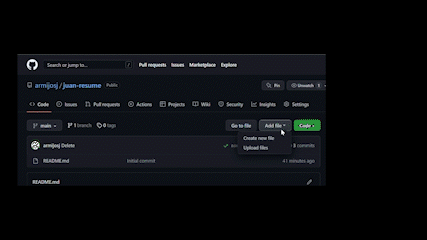

# How to host a resume on Github

--- 

### Purpose 

The following document will walk you through how to host a resume on GitHub Pages using Markdown and Jekyll. Here is a [demo](https://armijosj.github.io/juan-resume/) (currently not being hosted) of how it will look. Additionally, it will demonstrate and explain the fundamental ideas of Andrew Etter's book, "Modern Technical Writing."

---

## Prerequisites 

### Resume in Markdown
You will need your resume formatted in Markdown (a lightweight markup language). You can find a Markdown Tutorial and a cheat sheet under [Resources](#resources) that will help you get started.

### Static Site Generator

#### Jekyll (Optional)
Jekyll is the static site generator that you will need if you wish to run your page locally. For downloading, follow the detailed instructions on [Ruby Install Instruction](https://jekyllrb.com/docs/installation/).

### Markdown Editor

#### Visual Studio Code
Visual Studio Code is my editor of choice because it has many more functionalities than just being a markdown editor. You can follow these steps to download VS Code: [Download VS Code](https://learn.microsoft.com/en-us/visualstudio/install/install-visual-studio?view=vs-2022)

#### Other options
Some other alternatives are: [Atom](https://atom.io) and [Sublime Text](https://www.sublimetext.com). There are many [others](https://becomeawritertoday.com/best-markdown-editor/) that you can check out too.

### Distributed Version Control System

#### Github
Make sure you have a [Github](https://github.com/) account. If you don't have one already follow this steps: [Create a GitHub account](https://learn.microsoft.com/en-us/visualstudio/version-control/git-create-github-account?view=vs-2022).

--- 

## Instructions 

### Create a repository

1. Log into your [GitHub](https://GitHub.com) account.
2. At the top right corner of the website, click on the dropdown with the '**+**' symbol and select "**New Repository**".
3. Give your repository a name.

    

4. Leave _Visibility_ as **Public**.
5. Click on the checkbox to add a README.md. 
    
6. Finally, click on **Create repository**.

---

### Enabling GitHub Pages

1. At the main page of your repository, click on "**Settings**". This is located on the toolbar under the repository's name. 
2. Scroll down to the section called "**GitHub Pages**".
3. GitHub Pages is disabled by default. To enable, click on the dropdown menu under "**Source**" and choose the "**main**" branch.
4. Finally, click on "**Save**" to finalise changes. 

    

---

### Create _config.yml file (if not created automatically)
1. Go to the main page of your repository. 
2. Above the file table where the contents of your repository are stored, click on "**Add file**" then select "**Create new file**". 
3. Set the name of the file as: ```_config.yml```

    

4. To finalise or commit these changes, navigate to the **Commit Changes** section. Adding a description is optional.
5. Click on "**Commit Changes**".
--- 

### Uploading Your Resume on GitHub
1. Open your [markdown editor](#markdown-editor) and create a new Markdown file called ```index.md```. 

2. Create or re-create and format your resume in ```index.md```.
3. Go to the main page of your repository. 
4. Above the file table where the contents of your repository are stored, click on "**Add file**" then select "**Upload files**". 

    

5. Upload ```index.md``` by dragging the file into the upload are.
6. To finalise or commit these changes, navigate to the **Commit Changes** section. Adding a description is optional.
7. Click on "**Commit Changes**" to upload ```index.md``` to the repository. 

---

### Choosing a Jekyll Theme for Your GitHub Page

1. Ensure that GitHub Pages [is enabled](#Setting-Up-GitHub-Pages). 
2. Navigate to [Jekyll themes](https://pages.github.com/themes/)
3. Copy the name of the owner and the repository of the theme that you liked.
4. Paste both names into your site’s _config.yml file as follows:

```
remote_theme: owner/name
```
5. In the case of this tutorial, it would be **owner:** _pages-themes_, and **name:** _midnight@v0.2.0_

    

---

### Viewing your GitHub Page

1. Navigate to the settings page of your repository.
2. Scroll down to the section called "**GitHub Pages**".
3. Click on _Visit Site_ Button.
4. You should be able to see your resume, which is now on GitHub Pages!

    

5. Alternatively, you could type ```https://<Your GitHub Username>.github.io/<repository-name>```. In the case of this tutorial, it would be ```https://armijosj.github.io/juan-resume/```.

---

## Principles of Technical Writing 

The following principles that Eter outlines in his book "Modern Technical Writing" have just been put into practise.

#### Using a Lightweight Markup Language
There are many advantages when using lightweight markup languages. To begin with, they are more user-friendly to use than anything like XML and are simple to learn. They are also very readable. According to Andrew Etter, as long as the entry barrier is simple and easy to learn, everyone may contribute. The simplicity of contributing is vital in open-source projects.

This README and "index.md" both use Markdown to make editing and formatting simpler. Inline styles are available in Markdown, which is likewise plain text and helps to better arrange notions. Reading with ease facilitates comprehension and digestion of the text.

#### Using Static Websites
According to Etter, static websites should be used because of how simple and adaptable they are. Static websites are a great option for documents that need to be updated frequently because doing so simply requires rewriting the content (which is usually written in a lightweight markup language).

Hosting a CV on GitHub Pages serves as an example of using a static website. You can amend the content of the resume by editing "index.md," and you'll be able to see your changes immediately after submitting them to the repository.

#### Static Site Generators
Using a static site generator is the simplest approach to constructing a static website. In our resume tutorial, we utilised GitHub Pages, a static site generator powered by Jekyll. We chose a Jekyll theme, supplied the resume material that is contained in "index.md," and Jekyll generated the static site. It behaves similarly to a standard HTML website.

The practice of [single-sourcing] (https://en.wikipedia.org/wiki/Single-source publishing) is followed when using static webpages. Therefore, the information can be distributed widely and viewed on a variety of devices, but the content can only be modified in one location.

#### Why Use a Distributed File Sharing System?
By separating local and distant operations using a distributed file sharing system, it is possible to edit documentation offline while maintaining centralized control. Git's merging methodology, in the case of GitHub, which we utilized for this README tutorial, is excellent for documentation with many contributors.

---

## Resources 
- ["Modern Technical Writing" by Andrew Etter](https://www.amazon.com/Modern-Technical-Writing-Introduction-Documentation-ebook/dp/B01A2QL9SS)
- [Markdown Tutorial](https://www.markdowntutorial.com/)
- [Markdown Quick Reference Sheet](https://wordpress.com/support/markdown-quick-reference/)
- [Even more Jekyll themes](https://github.com/topics/jekyll-theme)

---

## Authors and Acknowledgments 

We gratefully acknowledge support from:
#### Author
- [Juan Armijos](https://github.com/armijosj)  
#### Group Members/Peer Editors
- Wen, Chu Hao
- Sood, Tanish
- Patel, Khush Bhrugesh
#### Template Author
- [Pages Theme](https://github.com/pages-themes/midnight) 

---

## FAQ 

#### Q: Why is Markdown better than a word processor?

**A:** Because Markdown provides a great website export and it is lightweight. In this way documents can be updated regularly and be kept in a version control.

#### Q:Why is my resume not showing up?

**A:** Make sure that your resume file is named ```index.md``` and that your ```_config.yml``` is formated correctly.
